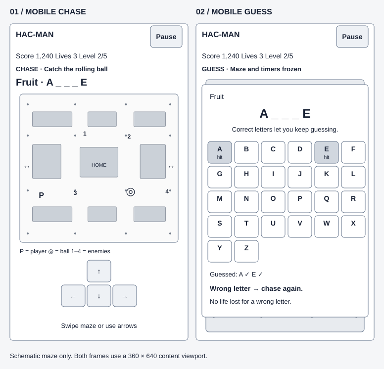
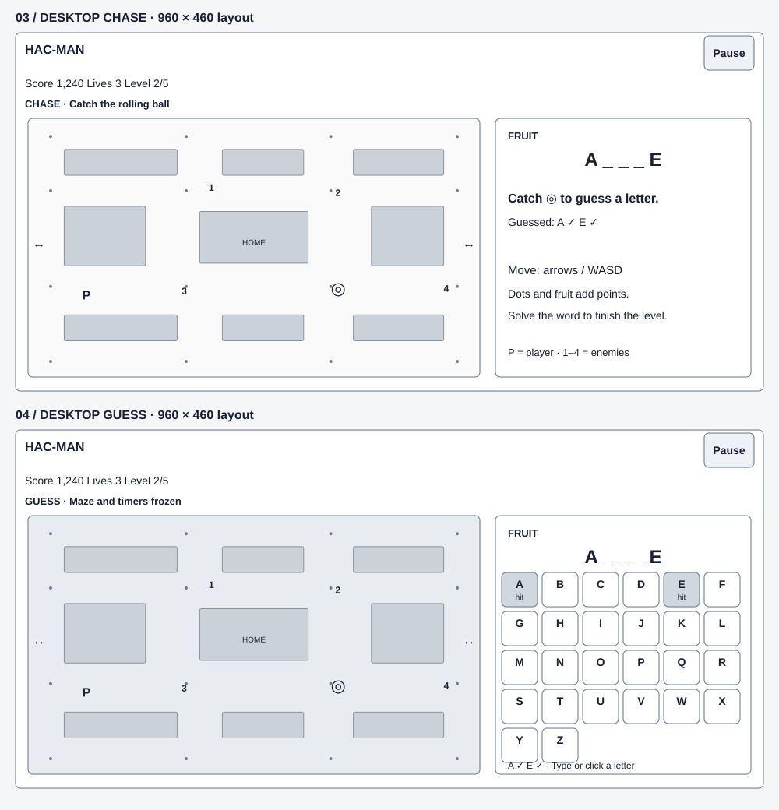
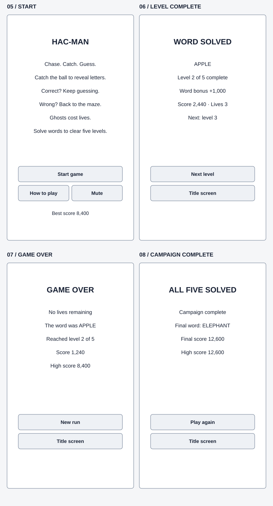

# Hac-Man wireframes

M0 planning reference for Claude. These layouts elaborate PRD v1.0 without changing its gameplay rules or estimates. SVGs are editable planning assets, not executable UI or final artwork. Screen values are illustrative; the maze is a schematic placeholder, not a validated level map.

## Mobile: Chase and Guessing

Each outlined phone content area is 360 × 640 CSS pixels, excluding browser chrome. Read each frame at its intrinsic size for dimensions; a document viewer may scale the sheet.

**01 — Chase:** persistent header with mute and pause, score/lives/level row, explicit mode label, category and word mask, maze, then a directional pad. The target ball has a ring marker distinct from the numbered enemy placeholders. A visible pad supports play without learning swipe gestures. No letter keyboard is active while chasing.

**02 — Guessing:** keep the HUD visible and freeze/dim the maze. Place an opaque guessing panel over the play area, showing category, word mask, feedback, and A–Z buttons. Hide/disable the movement pad in this mode. The six-column alphabetical grid uses 48 × 44 pixel keys with six-pixel horizontal gaps; all 26 letters fit in five rows without a native keyboard or scrolling at the reference viewport. Used letters remain visible but disabled, with hit/miss text or symbols in addition to color. The complete previous-guess list can wrap within the feedback area; the grid itself always retains every letter's state.

Correct example: guessing P in `A _ _ _ E` reveals both positions, resulting in `A P P _ E`, and keeps the panel open. A duplicate P does nothing. Wrong example: Z marks a miss and transitions to the resume countdown, with the maze still frozen until it ends. No life is deducted.

Layout budget for the Chase reference: header/HUD/mode and word region approximately 140 px; maze 320 × 300 px; legend 24 px; pad 152 × 94 px; remaining space for gaps and the control hint. The maze viewport is a bounding box: preserve square maze tiles and letterbox the final map rather than stretching it.

## Desktop: Chase and Guessing

**03 — Chase:** a 960 × 460 reference shell places the maze on the left and category, word progress, guessed letters, and keyboard hints on the right. Keep the HUD and pause/mute controls across the top. Extra desktop height may enlarge the maze while preserving its aspect ratio. Keyboard controls are arrows/WASD; touch-capable devices still need a visible directional pad.

**04 — Guessing:** retain the two-column layout and freeze/dim the maze. Replace the right-hand chase instructions with the letter keyboard, keeping category, word progress, and guessed-letter state. The illustrated keys are 46 × 44 px. Capture A–Z for guesses only while this mode is active; WASD must not move the player here. The mobile and desktop views expose the same actions and rules.

## Start and results

The mobile-sized panels also serve as centered panels on desktop, with a dimmed maze behind results when available.

| Screen | Content | Primary action | Secondary action |
| --- | --- | --- | --- |
| 05 — Start | Game title, short chase/catch/guess explanation, local high score | Start game → level 1 Chase | How to play; mute |
| 06 — Level complete | Solved word, completed level, awarded word bonus, score and lives | Next level → reset level state and begin Chase | Title screen, abandoning the current run |
| 07 — Game over | Revealed word, zero-lives explanation, reached level, score/high score | New run → fresh level 1 | Title screen |
| 08 — Campaign complete | Five-level completion, final word and score/high score | Play again → fresh level 1 | Title screen |

How to play expands into a readable panel with the controls and rules from PRD section 3, plus a Back action. A user-triggered Start enables audio if unmuted. Installation instructions and an update-ready notice, when applicable, belong on the title screen; they do not interrupt a run.

## Pause and transition overlays

Use the same centered panel treatment on both platforms; keep the HUD visible and freeze the maze behind it. Small transition overlays need no additional screen layout.

| State | Visible content | Controls / behavior |
| --- | --- | --- |
| PAUSED | “Paused”; current word progress; optional “Game paused while away” reason | Resume, Restart run, Mute. Resume restores the prior active mode; it never starts Chase when paused during Guessing. |
| RESUMING after wrong guess | “Z is not in the word. Catch the ball again.” followed by a short countdown | No letter or movement actions accepted during countdown. Clear held inputs; then enter Chase with the respawned ball. |
| DYING | “Caught! 2 lives remaining” | No gameplay input; reset actors according to PRD and return to Chase with two seconds of protection. At zero lives, show Game over. |
| LEVEL_COMPLETE | The result panel shown above | Explicit Next level prevents accidental advancement and duplicate bonuses. |

## Responsive behavior and accessibility notes

- Use available content width and height, including safe-area insets, rather than device names. At 360 × 640, prioritize the HUD, maze, and movement controls fitting together. Shrink the maze bounding box before shrinking touch targets. Final fit requires implementation/device verification.
- At wide landscape sizes, move the word/status and touch pad beside the maze. A touch landscape layout must not simply remove the pad. In short Guessing layouts, use available width for more letter columns (at least 44 × 44 px per key) or allow panel scrolling while the simulation is frozen. Do not require rotation.
- For larger text or smaller viewports, permit scrolling in menus and frozen guessing panels. Avoid horizontal page scrolling. Keep active Chase controls in view and preserve maze aspect ratio.
- Use real HTML buttons and text over/alongside the canvas. Guess controls should not invoke the device's text keyboard. Native focus indicators and readable labels are required.
- On capture, focus the guessing panel heading, then place unguessed letters in predictable keyboard order. Announce revealed word progress and hit/miss feedback. Used buttons are disabled; move focus to the next enabled letter if the focused one becomes disabled.
- On return to Chase, clear letter focus and held inputs; direct focus to the play region. Pause/result overlays own focus while open and restore it appropriately. Escape may open pause; an already paused screen requires explicit Resume.
- Shape/text distinguishes player, ball, enemies, frightened state, and used guesses. The monochrome schematic does not define final colors, animation, typography, or asset designs.

## Implementation checks to carry into milestones

1. M1: mobile HUD/maze/pad and desktop shell render without horizontal overflow; turn controls are usable. Later-milestone content in these wireframes is not an M1 requirement.
2. M2: capture swaps controls, freezes the maze, reveals repeated letters, rejects duplicates, and routes a miss through the countdown; final letter opens the result panel once.
3. M3: pause/background handling and death screens preserve the PRD state contract.
4. M4: result summaries reflect actual score/lives and campaign progression.
5. M5: verify target sizes, focus, text scaling, landscape, safe areas, and real-device usability. SVG geometry is a design reference, not evidence that these runtime checks pass.

Validation: SVG XML parses successfully and reference geometry has been checked in source. The project owner visually verified the wireframes on 2026-09-17 and confirmed they are OK. Wireframe visual review is complete; implemented UI layout and accessibility still require the milestone checks above. No application tests exist yet.
